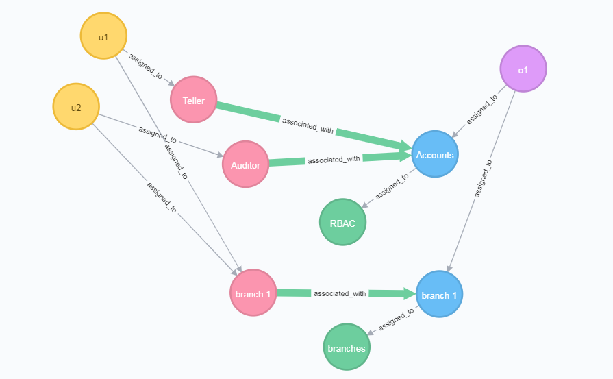

# policy-machine-core

## Introduction

The purpose of Policy Machine Core project is to provide a bare bones library for NGAC.  This library includes interfaces
to interact with NGAC components,simple implementations of those interfaces, and algorithms to query the state of a graph.
This is a great place to start experimenting with NGAC and different policy configurations.

## Installation

### Install using Maven
Policy Machine Core uses [JitPack](https://jitpack.io/) to compile and build the artifact to import into projects.
First, add jitpack as a repository
```xml
<project>
  --
  <repositories>
      <repository>
          <id>jitpack.io</id>
          <url>https://jitpack.io</url>
      </repository>
  </repositories>
  --
</project>
```
Then, add the maven dependency
```xml
<dependency>
    <groupId>com.github.PM-Master</groupId>
    <artifactId>policy-machine-core</artifactId>
    <version>1.0.0</version>
</dependency>
```
That's it, now the policy-machine-core library will be available for use in your project!

## Usage

### Creating a Graph
```
Graph graph = new Graph();
```
This will create a new instance of the in memory implementation of the Graph interface. Now it can be populated with
nodes, assignments, and associations.

```
graph.createNode(new Node(1234, "newNode", NodeType.O, null));
```
This will add a node with the ID 1234, name "newNode", type object, and no properties to the graph.

```
graph.assign(new Node(1234, NodeType.O), new Node(4321, NodeType.OA));
```
Assuming a node with the ID 4321 and type OA have been created in the graph, this will assign the node with ID 1234 to the 
node with ID 4321.

```
graph.associate(new Node(2222, NodeType.UA), new Node(4321, NodeType.OA), new HashSet<>(Arrays.asList("read", "write")));
```
Assuming a user attribute node is created with the ID 2222, this will associate it with the object attribute that has the 
ID 4321, and give the operations read and write.

**Examples of creating graphs are provided [below](#examples)**

### Access Decisions
To make an access decision, instantiate a `PReviewDecider` which implements the `Decider` interface. The interface provides
several methods to query the current access state of the graph.
```
Decider decider = new PReviewDecider(graph);
decider.listPermissions(userID, NO_PROCESS, targetID);
```
The `listPermissions` method returns the permissions a user has on a target node.

### Audit
#### Explain
Explain answers the question *Why does a user have access to a given target node?* To perform this, instantiate a new 
`PReviewAuditor` and call the `explain` method.
```
Auditor auditor = new PReviewAuditor(graph);
Map<String, List<Path>> explain = auditor.explain(1234, 4321);
```
The result of the explain method is a map of policy classes to the paths from the user to the target under each policy class.
The `Path` object contains a list of `Edge` objects and represents a series of paths from the user to the target. An `Edge` has
a source node, a target node, and a set of operations. If the operations is null, the edge represents an assignment in the
path. If it is not null then the edge is an association (the bridge from the user path to the target path).

## Examples

### Serialization
#### Graph
Serialize a graph into a json string.
```
Graph graph = new MemGraph();
---
String json = GraphSerializer.toJson(graph);
```
Deserialize a json string to a graph.
```
Graph graph = GraphSerializer.fromJson(new MemGraph(), json);
```
#### Prohibitions
Serialize a ProhibitionDAO into a json string.
```
ProhibitionsDAO dao = new MemProhibitionsDAO();
---
String json = ProhibitionsSerializer.toJson(dao);
```
Deserialize a json string to a ProhibitionsDAO.
```   
ProhibitionsDAO deDao = ProhibitionsSerializer.fromJson(new MemProhibitionsDAO(), json);
```


### Bank Teller

#### Graph configuration summary

- Users: u1, u2
- An object o1
- Two policy classes: RBAC and Branches
    - RBAC
        - o1 is assigned to accounts
        - u1 is a Teller that has read and write permissions on accounts
        - u2 is an Auditor that has read permissions on accounts
    - Branches
        - u1 and u2 are both assigned to the Branch 1 user attribute
        - o1 is assigned to the Branch 1 object attribute
        - the Branch 1 user attribute has read and write permissions on the Branch 1 object attribute

#### Access control state

- u1 can read and write o1
- u2 can read o1
---

#### Code Wakthrough
```
// 1. Create a new Graph instance.  For this example, we'll use the `MemGraph` which is an in memory implementation of the Graph interface.
Graph graph = new MemGraph();

// 2. Create the user nodes `u1` and `u2`.
long user1ID = graph.createNode(new Node(rand.nextLong(), "u1", U, null));
long user2ID = graph.createNode(new Node(rand.nextLong(), "u2", U, null));


// 3. Create the object, `o1` that will be the target of the access queries.
long objectID = graph.createNode(new Node(rand.nextLong(), "o1", O, null));


// 4. Create the `RBAC` policy class node.
long rbacID = graph.createNode(new Node(rand.nextLong(), "RBAC", PC, null));


// 5. Create an object attribute for the `Accounts`.
long accountsID = graph.createNode(new Node(rand.nextLong(), "Accounts", OA, null));


// 6. Create the `Teller` and `Auditor` user attributes.
long tellerID = graph.createNode(new Node(rand.nextLong(), "Teller", UA, null));
long auditorID = graph.createNode(new Node(rand.nextLong(), "Auditor", UA, null));


// 7. Assign the `Accounts` object attribute to the `RBAC` policy class node.
graph.assign(new Node(accountsID, OA), new Node(rbacID, PC));


// 8. Assign the object, `o1`, to the `Accounts` object attribute.
graph.assign(new Node(objectID, O), new Node(accountsID, OA));


// 9. Assign `u1` to the `Teller` user attribute and `u2` to the `Auditor` user attribute.
graph.assign(new Node(user1ID, U), new Node(tellerID, UA));
graph.assign(new Node(user2ID, U), new Node(auditorID, UA));


// 10. Create the associations for `Teller` and `Auditor` on `Account` in RBAC. `Teller` has read and write permissions, while `Auditor` just has read permissions.
graph.associate(new Node(tellerID, UA), new Node(accountsID, OA), new HashSet<>(Arrays.asList("r", "w")));
graph.associate(new Node(auditorID, UA), new Node(accountsID, OA), new HashSet<>(Arrays.asList("r")));


// 11. Create the `Branches` policy class.
long branchesID = graph.createNode(new Node(rand.nextLong(), "branches", PC, null));


// 12. Create an object attribute for `Branch 1`.
long branch1OAID = graph.createNode(new Node(rand.nextLong(), "branch 1", OA, null));

// 13. Assign the branch 1 OA to the branches PC
graph.assign(new Node(branch1OAID, OA), new Node(branchesID, PC));


// 14. Create the `Branch 1` user attribute
long branches1UAID = graph.createNode(new Node(rand.nextLong(), "branch 1", UA, null));


// 15. Assign the object, `o1`, to the `Branch 1` object attribute
graph.assign(new Node(objectID, O), new Node(branch1OAID, OA));


// 16. Assign the users, `u1` and `u2`, to the branch 1 user attribute
graph.assign(new Node(user1ID, U), new Node(branches1UAID, UA));
graph.assign(new Node(user2ID, U), new Node(branches1UAID, UA));


// 17. Create an association between the `branch 1` user attribute and the `branch 1` object attribute.
//This will give both users read and write on `o1` under the `branches` policy class.
graph.associate(new Node(branches1UAID, UA), new Node(branch1OAID, OA), new HashSet<>(Arrays.asList("r", "w")));


// 18. Test the configuration using the `PReviewDecider` implementation of the `Decider` interface.
//The constructor for a `PReviewDecider` receives the graph we created and a list of prohibitions.
//Since no prohibitions are used in this example, we'll pass null.
Decider decider = new PReviewDecider(graph, null);


// 19. Check that `u1` has read and write permissions on `o1`.
Set<String> permissions = decider.listPermissions(user1ID, 0, objectID);
assertTrue(permissions.contains("r"));
assertTrue(permissions.contains("w"));


// 20. Check that `u1` has read permissions on `o1`.
permissions = decider.listPermissions(user2ID, 0, objectID);
assertTrue(permissions.contains("r"));
```

#### Visualization
Below is a visual representation of the graph created in the bank teller example.
[](images/bankteller.png)


### Employee Record

#### Example configuration summary

- One policy class
- Users: bob, alice, charlie
- The objects are bob's and alice's name, salary, and ssn.
- All users are assigned to the Staff user attribute
- The Staff user attribute has read permissions on Public Info, which in this case is names.
- Charlie has the HR attribute
- HR has read and write permissions on Salaries and SSNs
- Bob and Alice have the Grp1Mgr and Grp2Mgr attributes, respectively
- Grp1Mgr and Grp2Mgr have read permissions on Grp1Salaries and Grp2Salaries, respectively
- Bob and Alice have read and write permissions on their name and ssn, and read permissions on their salaries. 

#### Access control state

- Alice can read and write her name and SSN, and read her salary, and the salaries of those in Group 2.
- Bob can read and write his name and SSN, and read his salary, and salaries of those in Group 1.
- Charlie can read and write all salaries and SSNs, and read all names.

```
Graph graph = new MemGraph();

// create nodes
// object attributes
long salariesID = graph.createNode(new Node(rand.nextLong(), "Salaries", OA, null));
long ssnsID = graph.createNode(new Node(rand.nextLong(), "SSNs", OA, null));
long grp1SalariesID = graph.createNode(new Node(rand.nextLong(), "Grp1 Salaries", OA, null));
long grp2SalariesID = graph.createNode(new Node(rand.nextLong(), "Grp2 Salaries", OA, null));
long publicID = graph.createNode(new Node(rand.nextLong(), "Public Info", OA, null));

long bobRecID = graph.createNode(new Node(rand.nextLong(), "Bob Record", OA, null));
long bobRID = graph.createNode(new Node(rand.nextLong(), "Bob r", OA, null));
long bobRWID = graph.createNode(new Node(rand.nextLong(), "Bob r/w", OA, null));

long aliceRecID = graph.createNode(new Node(rand.nextLong(), "Alice Record", OA, null));
long aliceRID = graph.createNode(new Node(rand.nextLong(), "Alice r", OA, null));
long aliceRWID = graph.createNode(new Node(rand.nextLong(), "Alice r/w", OA, null));

// objects for bob's name, salary, and ssn
long bobNameID = graph.createNode(new Node(rand.nextLong(), "bob name", O, null));
long bobSalaryID = graph.createNode(new Node(rand.nextLong(), "bob salary", O, null));
long bobSSNID = graph.createNode(new Node(rand.nextLong(), "bob ssn", O, null));

// objects for alice's name, salary, and ssn
long aliceNameID = graph.createNode(new Node(rand.nextLong(), "alice name", O, null));
long aliceSalaryID = graph.createNode(new Node(rand.nextLong(), "alice salary", O, null));
long aliceSSNID = graph.createNode(new Node(rand.nextLong(), "alice ssn", O, null));

// user attributes
long hrID = graph.createNode(new Node(rand.nextLong(), "HR", UA, null));
long grp1MgrID = graph.createNode(new Node(rand.nextLong(), "Grp1Mgr", UA, null));
long grp2MgrID = graph.createNode(new Node(rand.nextLong(), "Grp2Mgr", UA, null));
long staffID = graph.createNode(new Node(rand.nextLong(), "Staff", UA, null));
long bobUAID = graph.createNode(new Node(rand.nextLong(), "Bob", UA, null));
long aliceUAID = graph.createNode(new Node(rand.nextLong(), "Alice", UA, null));

// users
long bobID = graph.createNode(new Node(rand.nextLong(), "bob", U, null));
long aliceID = graph.createNode(new Node(rand.nextLong(), "alice", U, null));
long charlieID = graph.createNode(new Node(rand.nextLong(), "charlie", U, null));

// policy class
long pcID = graph.createNode(new Node(rand.nextLong(), "Employee Records", PC, null));


// assignments
// assign users to user attributes
graph.assign(new Node(charlieID, U), new Node(hrID, UA));
graph.assign(new Node(bobID, U), new Node(grp1MgrID, UA));
graph.assign(new Node(aliceID, U), new Node(grp2MgrID, UA));
graph.assign(new Node(charlieID, U), new Node(staffID, UA));
graph.assign(new Node(bobID, U), new Node(staffID, UA));
graph.assign(new Node(aliceID, U), new Node(staffID, UA));
graph.assign(new Node(bobID, U), new Node(bobUAID, UA));
graph.assign(new Node(aliceID, U), new Node(aliceUAID, UA));

// assign objects to object attributes
// salary objects
graph.assign(new Node(bobSalaryID, O), new Node(salariesID, OA));
graph.assign(new Node(bobSalaryID, O), new Node(grp1SalariesID, OA));
graph.assign(new Node(bobSalaryID, O), new Node(bobRID, OA));

graph.assign(new Node(aliceSalaryID, O), new Node(salariesID, OA));
graph.assign(new Node(aliceSalaryID, O), new Node(grp2SalariesID, OA));
graph.assign(new Node(aliceSalaryID, O), new Node(aliceRID, OA));

// ssn objects
graph.assign(new Node(bobSSNID, O), new Node(ssnsID, OA));
graph.assign(new Node(bobSSNID, O), new Node(bobRWID, OA));

graph.assign(new Node(aliceSSNID, O), new Node(aliceID, OA));
graph.assign(new Node(aliceSSNID, O), new Node(aliceRWID, OA));

// name objects
graph.assign(new Node(bobNameID, O), new Node(publicID, OA));
graph.assign(new Node(bobNameID, O), new Node(bobRWID, OA));

graph.assign(new Node(aliceNameID, O), new Node(publicID, OA));
graph.assign(new Node(aliceNameID, O), new Node(aliceRWID, OA));

// bob and alice r/w containers to their records
graph.assign(new Node(bobRID, OA), new Node(bobRecID, OA));
graph.assign(new Node(bobRWID, OA), new Node(bobRecID, OA));

graph.assign(new Node(aliceRID, OA), new Node(aliceRecID, OA));
graph.assign(new Node(aliceRWID, OA), new Node(aliceRecID, OA));


// assign object attributes to policy classes
graph.assign(new Node(salariesID, OA), new Node(pcID, PC));
graph.assign(new Node(ssnsID, OA), new Node(pcID, PC));
graph.assign(new Node(grp1SalariesID, OA), new Node(pcID, PC));
graph.assign(new Node(grp2SalariesID, OA), new Node(pcID, PC));
graph.assign(new Node(publicID, OA), new Node(pcID, PC));
graph.assign(new Node(bobRecID, OA), new Node(pcID, PC));
graph.assign(new Node(aliceRecID, OA), new Node(pcID, PC));

// associations
Set<String> rw = new HashSet<>(Arrays.asList("r", "w"));
Set<String> r = new HashSet<>(Arrays.asList("r"));

graph.associate(new Node(hrID, UA), new Node(salariesID, OA), rw);
graph.associate(new Node(hrID, UA), new Node(ssnsID, OA), rw);
graph.associate(new Node(grp1MgrID, UA), new Node(grp1SalariesID, OA), r);
graph.associate(new Node(grp2MgrID, UA), new Node(grp2SalariesID, OA), r);
graph.associate(new Node(staffID, UA), new Node(publicID, OA), r);
graph.associate(new Node(bobUAID, UA), new Node(bobRWID, OA), rw);
graph.associate(new Node(bobUAID, UA), new Node(bobRID, OA), r);
graph.associate(new Node(aliceUAID, UA), new Node(aliceRWID, OA), rw);
graph.associate(new Node(aliceUAID, UA), new Node(aliceRID, OA), r);

// test configuration
// create a decider
// not using prohibitions in this example, so null is passed
Decider decider = new PReviewDecider(graph, null);

// user: bob
// target: 'bob ssn'
// expected: [r, w]
// actual: [r, w]
Set<String> permissions = decider.listPermissions(bobID, 0, bobSSNID);
assertTrue(permissions.contains("r"));
assertTrue(permissions.contains("w"));

// user: bob
// target: 'bob ssn'
// expected: [r]
// actual: [r]
permissions = decider.listPermissions(bobID, 0, bobSalaryID);
assertTrue(permissions.contains("r"));

// user: bob
// target: 'alice ssn'
// expected: []
// actual: []
permissions = decider.listPermissions(bobID, 0, aliceSSNID);
assertTrue(permissions.isEmpty());

// user: bob
// target: 'alice salary'
// expected: []
// actual: []
permissions = decider.listPermissions(bobID, 0, aliceSalaryID);
assertTrue(permissions.isEmpty());

// user: bob
// target: 'bob ssn'
// expected: [r, w]
// actual: [r, w]
permissions = decider.listPermissions(aliceID, 0, aliceSSNID);
assertTrue(permissions.contains("r"));
assertTrue(permissions.contains("w"));

// user: charlie
// target: 'alice salary'
// expected: [r, w]
// actual: [r, w]
permissions = decider.listPermissions(charlieID, 0, aliceSalaryID);
assertTrue(permissions.contains("r"));
assertTrue(permissions.contains("w"));
```

#### Visualization
Below is a visual representation of the graph created in the employee record example.
[](images/emprec.png)